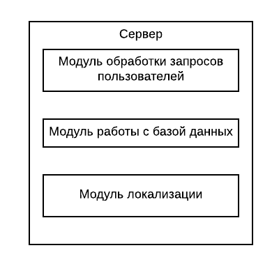
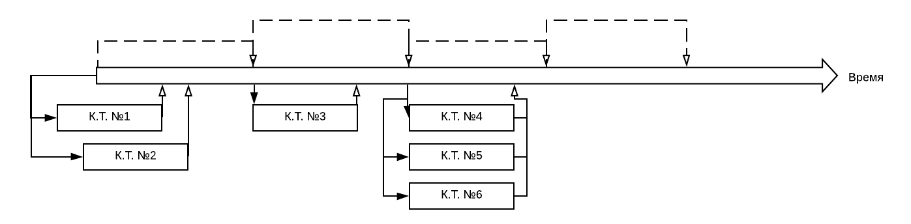
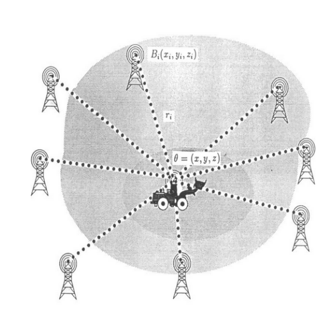
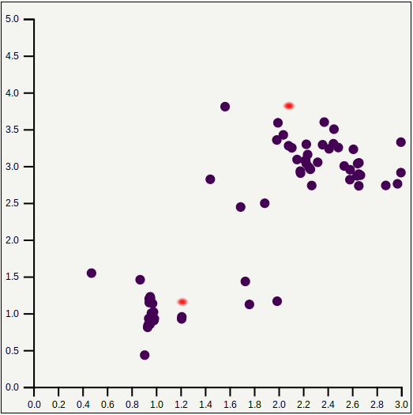

# Система мониторинга перемещения охраны

## Цель
Целью создания данной системы является уменьшение потерь предприятий от краж за счет увелечения  контроля над исполнителями охранной деятельности, согласно [1] средняя оценка потерь от кражи крупного оборудования по США составляет приблизительно 400 миллионов долларов США. Одной из причин высокого уровня краж составители отчета называют плохую охрану оборудования и периметра.

## Постановка задачи
Разработать систему, которая позволяет:
* В реальном времени отслеживать перемещение сотрудников охраны;
* Отслеживать прохождение контрольных точек и генерировать уведомления об отклонении от маршрута;

## Проектирование. Коцепт системы
В ходе проектирования были приняты следующие решения: 
1.  Локализация будет реализована с помощью трилатерации на основе мощности сигнала в связи с доступностью соответствующей аппаратной базы, которую будет относительно просто развернуть на объекте, и возможности реализовать отслеживаемое устройство с помощью телефона на операцинной сисетмы андройд, которые являются широкораспространенными.
2.  Систему было решено реализовывать в клиент-серверной парадигме для того, чтобы была возможность как разместить систему непосредственно на объекте, так и вне его.
На основе 1 и 2 была разработана концептуальная модель системы представленная на рисунке:


Для обеспечения более простого и ясного взаимодействия между частями системы был разработан протокол передачи данных на базе JSON со следующей структурой:
```
{
 header : a_security,
 data : {
	 userID : userID,
	 time : time,
	 signals : {
		    wifi :{st1:rssi1,...},
                                bluetooth :{st1:rssi1,...}
		   }
        }
}
```

## Реализация. Сервер
В качестве реализации сервера был выбран асинхронный веб сервер, предоставляемый библиотекой aiohttp, так как на основе анализа функций сервера было обнаружено, что сервер не обладает вычислительно сложными операциями и большая часть времени уходит на обращение к базе данных.
Так же Python обладает понятным синтаксисом и быстрым времени разработки на нем, что позволяет сократить временно-трудовые затраты не сильно жертвуя производительностью.
На сервер были определены задачи по обслуживанию клиентов, работы с базой данных и модуль локализации.


Так же были выделены клиенты сервера: Передатчик, Диспетчер и Веб-интерфейс, которые далее будут рассмотренны более подробно. 

## Реализация. Передатчик
Передатчик, отвечает за получение, усреднение, и передачу данных об уровнях сигналов ближайших датчиков серверу.
В качестве передатчика был реализовано android приложение на языке Java, внешний вид которого можно видеть на рисунке, с поддержкой фильтрации, усреднения, передачи RSSI.

WiFi/ВT датчик был реализован на основе модулей esp8266 и hc-05. Датчики
настраивались с помощью AT-комманд. На рисунуке приведен готовый датчик.


## Реализация. Диспетчер

Диспетчер, осуществляет мониторинг прохождения контрольных точек в соответствии с планом и генерацию уведомлений в случае отклонения. Пример работы диспетчера продемонстрирован на рисунке.

Для реализации диспетчера был взят планировщик задач, предоставляемый библиотекой shed. Каждая задача в нем имеет свой приоритет и время выполнения. Он был доработан, для поддержки многопоточности, для того, чтобы одновременно выполняющиеся задачи не блокировали друг друга.

## Реализация. Веб-интерфейс
Через Веб интерфейс осуществляется визуализация и интерактивное взаимодействие системы и пользователя. Особенностью реализации является, тот факт, что между Сервером и Веб интерфейсом должна быть двухстороняя связь для осуществления отображения перемещений сотрудников охраны в реальном времени и своевременной выдачи уведомлений об отклонении. 

Веб интерфейс был реализован на основе связки HTML, CSS, JS с применением библиотек d3 для реализации визуализации перемещений и tabulator для создания интерактивных таблиц с поддержкой проверки ввода, автоматической синхронизацией данных с сервером, поиском и сортировкой.
Для реализации двухстороннего взаимодействия между сервером и веб интерфейсом было решено осуществлять коммуникацию между ними через WebSocket, для этого был реализован модуль на стороне клиента, позволяющий подписываться на определенные топики для получения данных от сервера. 
Общий вид интерфейса.


Окно редактирование данных.


## Локализация. Трилатерация
Трилатерация – подход, опирающийся на рассчитаные расстояниям до якорных точек (точек с заранее известной координатой), для определения местоположения.


 Для реализации трилатерации были выбраны 3 алгоритма, для последующего тестирования и анализа.

1. Трилатерация на основе линейных наименьших квадратов: исходная система уравнений приводится к линейному виду после непосредственно находится лучшее линейное приближение исходной системы.

2. Трилатерация на основе нелинейных наименьших квадратов: используя нелинейный оптимизатор scipy.

3. Трилатерация с помощью spring mass оптимизации.  Это итеративный  алгоритм в которой считается, что датчики действуют на передатчик с силой тем большей, чем больше абсолютная разница между измеренным расстоянием и расстоянием на основе текущей итерации решения. Принцип работы можно видеть на рисунке.  

## Локализация. Помехи в данных
Далее для тестирования имеющихся алгоритмов были собраны тестовые значения RSSI на расстоянии 1, 3 и 4 метров. Резултаты приведены на графике.


Из результатов видно, что нет однозначного соответствия между уровнем RSSI и расстоянием. Для аппроксимации неизвестной зависимости был выбран многослойный прецептрон, который показал точность превосходящую другие модели.

На основе имеющеся модели определения расстояния и предположения о мультипликативной модели ошибок (ошибка тем сильнее, чем больше расстояние до измеряемого объекта). Была построена эмперечиская функция вероятностей ошибок, которая в дальнейшем использовалась для тестирования алгоритмов с помощью симуляции.  
Гистограмма отклонений расстояний. 

Важным критерием в отборе алгоритма является его устойчивость к шуму в данных. На графике приведено сравнение алгоритмов на устойчивость к шуму.


Из рисунка видно, что с ростом ошибки трилатерация методом линейных наименьших квадратов начинает показывать себя хуже, чем другие алгоритмы.

## Локализация. Способы улучшения прогнозирования
Видно, что при высоком уровне шума ошибка может состявлять значительную величину в связи с этим было разработаны 2 стратегии улучшения качества прогназирования:

1. __Увеличение количества датчиков в зоне видимости передатчика.__  В качестве топологии размещения n датчиков была выбрано размещение их в углах правильного n угольника. Такая топология инвариантна к поворотам системы датчиков на углы кратные 2*pi/n.  На графике приведены результаты тестирования.  
 
Из графика видно, что увеличение количества датчиков приводит к улучшению результата, однако существенно увеличивать их количество не имеет смысла, во-первых, таким образом увеличивается цена развертывания системы на предприятии, а во-вторых, как видно из графика с ростом количетсва датчиков величина прироста точности уменьшается.
2. __Увеличение количества усреднений полученных RSSI перед решением задачи локализации.__  На графике приведены результаты тестирования. 

Из графика видно, что увеличение окна усреднения приводит к улучшению результата, однако большой размер окна усреднения уменьшает частоту получаемых данных о местоположении объекта локализации.

## Локализация. Оценка моделей и тестирование
Видно, что трилатерация на основе линейных наименьших квадратов, показывает себя хуже другие алгоритмы. Spring mass подход в целом предостваляет удолетворительные результаты, но имеет склонность находить локально оптимальные решения из-за особенностей своего функционирования, поэтому для использования был выбран подход на основе нелинейных наименьших квадратов.
На основе временных и аппаратных ограничений были выбраны следующие параметры:
* Размер окна усреднения: 5.
* Количество датчиков в зоне видимости передатчика: 4.

Результаты тестирования в симуляции для точек с разной удаленностью от центральной для датчиков точки можно увидеть на тепловой карте.


Тестирование в рамках комнаты можно увидеть на графике, где красным указаны реальные положения передатчика.


## Демонстрация
[](https://www.youtube.com/watch?v=7nU9br7JCpM)


## Пути развития системы
Система на данном этапе развития имеет следующие преспективы развития: 
* Улучшение UI для повышения эргономики системы;
* Оналайн корректировка поступающих RSSI;
* Переход к ToF подходу для определения расстояний между датчиком и передатчиком.

   